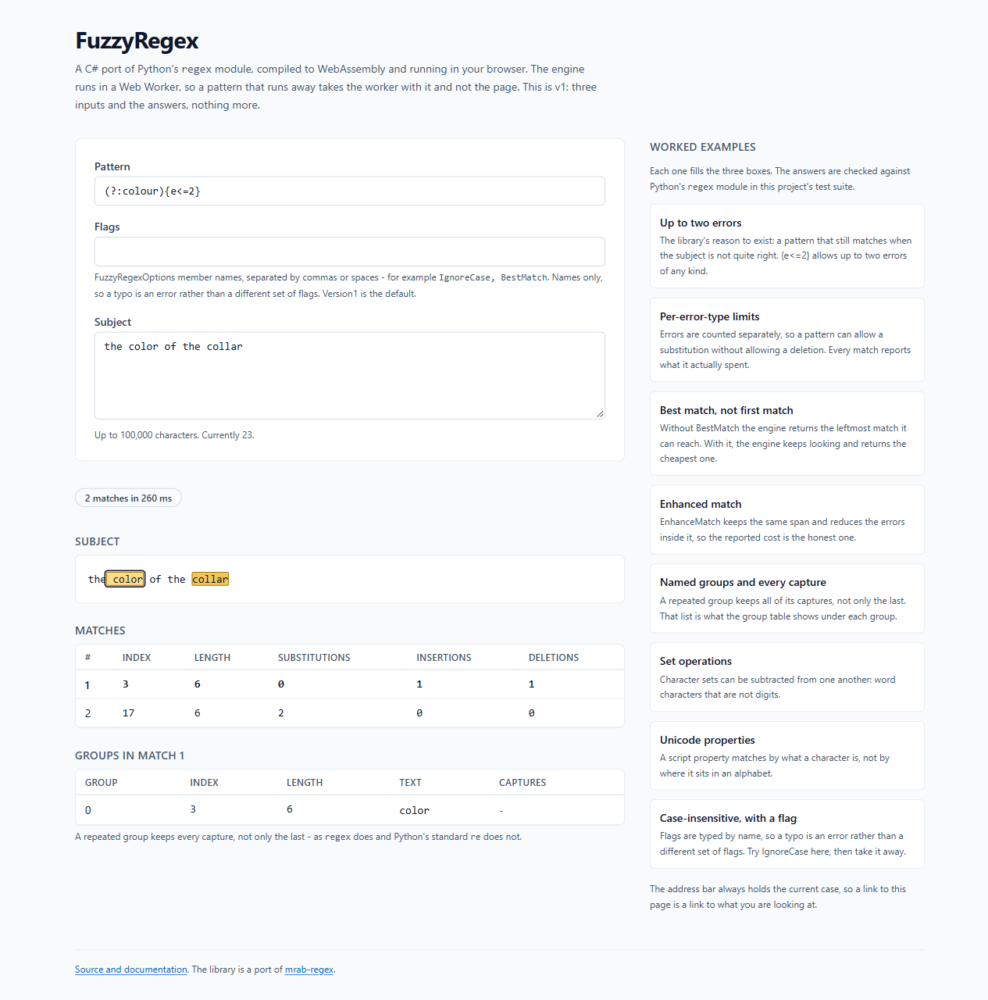

# The browser demo

A single page that runs this library, compiled to WebAssembly, entirely in the visitor's browser.
Nothing is sent anywhere: there is no server side, and the three inputs live in the URL fragment,
which [RFC 3986 section 3.5](https://www.rfc-editor.org/rfc/rfc3986#section-3.5) keeps on the client.

Live at <https://zejji.github.io/fuzzy-regex-cs/> once Pages is enabled (see "Deploy to GitHub Pages"
below).



## What is in here

| Path | What it is |
| --- | --- |
| `FuzzyRegex.Demo.Wasm/DemoEngine.cs` | The `[JSExport]` surface. Takes pattern, flags and subject; returns one JSON answer. Owns the engine-side caps. |
| `FuzzyRegex.Demo.Wasm/wwwroot/worker.js` | Boots the runtime inside a Web Worker and answers one request at a time. The engine never runs on the page's thread. |
| `FuzzyRegex.Demo.Wasm/wwwroot/examples.json` | The eight worked examples in the sidebar. Their answers are pinned by a test, so this file is not free-form copy. |
| `FuzzyRegex.Demo.Wasm/wwwroot/checks.html` | The browser-side verdict page. Drives the real page in an iframe and prints CHECKS GREEN or CHECKS RED. |
| `FuzzyRegex.Demo.Wasm/wwwroot/harness.html` | The engine-only harness from the previous slice. Kept because it isolates the worker from the page. |
| `web/` | The front end: Vite, Vue 3, TypeScript (strict) and Tailwind. `npm run build` writes the page into the folder above. |
| `web/src/demo.ts` | The page's state machine - debounce, worker pool, fragment, caps - with no DOM in it, which is why it can be unit tested. |
| `web/src/App.vue` | The layout: three inputs, status pills, highlighted subject, match and group tables, examples sidebar. |
| `web/src/lib/` | `caps.ts`, `fragment.ts`, `highlight.ts`, `pool.ts`. |
| `web/src/types.ts` | The TypeScript side of `DemoEngine`'s JSON, so a renamed field there is a build error here. |
| `web/tests/` | Vitest unit tests for all of the above, with fake workers and jsdom. |

The built page (`wwwroot/index.html` and `wwwroot/assets/`) is **generated and gitignored**. It is
written into the .NET web root on purpose: the wasm publish then gathers page, worker and runtime
into one static-asset manifest, which is what the smoke script checks and what Pages uploads.

Two more things live outside this folder because they are repository-wide:
`tools/build-demo-web.ps1` and `tools/run-wasm-smoke.ps1` (build, publish and check the artefact
set), and `.github/workflows/pages.yml` (deploys).

## Run it locally on Windows, from a fresh clone

### Prerequisites

- **.NET SDK 10.0.400 or a later patch of it.** `global.json` pins that band with
  `rollForward: latestPatch`, so a 10.0.4xx SDK works and an older one does not. Check with
  `dotnet --version`.
- **The `wasm-tools` workload.** The SDK does not carry it. Install it once per machine:

  ```powershell
  dotnet workload install wasm-tools
  ```

  On Windows this writes into the SDK's own folder, so run it from a terminal that is allowed to:
  an elevated PowerShell if the SDK is installed under `C:\Program Files`.
- **Node 22.12 or later**, and this one is required to build the page at all, not only to test it.
  `web/.nvmrc` pins 24, which is what the runs recorded in the slice notes used; `nvm use` in
  `demo/web` picks it up. `tools/build-demo-web.ps1` refuses below 22.12, which is Vite 8's floor.
- **Python 3**, only to serve the published files. Any static file server will do; Python's is used
  below because it is the one the browser runs in this repository were done with.

### Build, publish and serve

```powershell
git clone https://github.com/zejji/fuzzy-regex-cs.git
cd fuzzy-regex-cs
pwsh -File tools/build-demo-web.ps1
dotnet publish demo/FuzzyRegex.Demo.Wasm -c Release
cd demo/FuzzyRegex.Demo.Wasm/bin/Release/net10.0/publish/wwwroot
python -m http.server 8080
```

Then open <http://localhost:8080/>. The first answer should appear within a second or two of the
page settling; the status line tells you which state it is in ("starting the engine", "matching",
or the match count and how long it took).

**The front-end build comes first.** `npm run build` (which is all `build-demo-web.ps1` runs, after
`npm ci`) type-checks with `vue-tsc`, runs the Vitest suite, and only then writes
`wwwroot/index.html` and `wwwroot/assets/`. Publish without it and the publish gathers the previous
build's page, or no page at all on a fresh clone.

Serve the **publish** output, not the `wwwroot` source folder. The source folder has no
`_framework/`, so the page loads and the engine never starts.

The checked version of the whole thing:

```powershell
pwsh -File tools/run-wasm-smoke.ps1 -OutDir .scratch/demo-publish
```

That builds the front end, publishes, **and** asserts the artefact set: every file the static web
assets manifest names is on disk, every `integrity` hash matches a SHA-256 recomputed from the file,
nothing unnamed is left over, the page references assets that exist, and `.nojekyll` is at the web
root. Serve `.scratch/demo-publish/wwwroot` the same way. `.scratch/` is gitignored. This is what CI
runs, so it is the one that tells you whether a deployment would work.

### The dev server

```powershell
dotnet publish demo/FuzzyRegex.Demo.Wasm -c Release   # once, for the runtime
npm --prefix demo/web run dev
```

Vite serves the page with hot reload at the URL it prints. The three things it cannot bundle -
`_framework/`, `worker.js` and `examples.json` - are served by a small middleware in
`web/vite.config.ts` out of the most recent publish (Release, then Debug, then the source web root).
So the publish above is a prerequisite, but only once: it is the engine that is being served from
there, and the engine only changes when the C# does.

### Run the tests

```powershell
npm --prefix demo/web test        # Vitest, or `npm --prefix demo/web run build` for the lot
```

The C# side of the demo is covered by the main suite, in
`tests/FuzzyRegex.Tests/Gaps/Demo/`: `DemoExamplesTests` pins every sidebar example's answer against
the upstream `regex` module, and `DemoCapsTests` reads `web/src/lib/caps.ts` as text and checks its
numbers against `DemoEngine`'s, so the page's limits and the engine's cannot drift apart silently.

Neither of these is wired into `tools/check-ratchet.ps1` as a demo-specific step: the front-end
build runs in `pages.yml`, and the C# ones are ordinary tests in the ordinary suite.

For a verdict on the real page in a real browser, serve a publish as above and open `/checks.html`.
It drives `index.html` in an iframe - every worked example, the shared-link round trip, both page
caps, the non-participating group, a runaway pattern killed mid-match, and what the warm spare is
worth - and prints CHECKS GREEN or CHECKS RED.

## The front end

Vite 8, Vue 3.5, TypeScript 6 strict, Tailwind 4, Vitest 5. Every version is pinned exactly in
`web/package.json` and installed with `npm ci`, so the build on a laptop and the build on the runner
are the same build. No CDN: what ships is what was reviewed, bundled from `node_modules`.

Two notes for anyone upgrading:

- **`typescript` is pinned to 6.0.3, not to the current 7.x.** `vue-tsc@3.3.11` declares a peer
  range of `>=5.0.0`, and it is wrong: under TypeScript 7.0.2 it crashes at once with
  `ERR_PACKAGE_PATH_NOT_EXPORTED: Package subpath './lib/tsc' is not defined by "exports"`
  (measured 2026-09-18). Check that `vue-tsc --build` actually runs before taking a TypeScript
  major.
- **There is no `<base href>` in the page,** which is a deliberate difference from Microsoft's
  Blazor-on-Pages recipe. The bundle is document-relative (Vite's `base: './'`) and the worker is
  resolved against `document.baseURI`, so one artefact boots at the repository subpath on Pages, at
  the root of a local server and at a fork's preview path. Tested at both, not argued: `checks.html`
  is green at a server root and under `/fuzzy-regex-cs/`.

The layout follows Nielsen Norman Group's form-design guidance (one column, labels above their
field, hints that persist instead of placeholders), its response-time limits (the 250 ms debounce,
and a busy state that appears rather than a frozen page), and WCAG 2.2 for target size, focus
appearance and contrast. The two screenshots in `docs/demo/` are the reference layouts at 390 and
1280 px.

## Deploy to GitHub Pages

### The one-off repository setting

Do this once, by hand, in the repository on github.com. No workflow can do it for you.

1. **Settings**, then **Pages** in the left-hand menu.
2. Under **Build and deployment**, set **Source** to **GitHub Actions**.

There is nothing else to configure: no branch, no folder. Until this is set, the deploy job fails
with `Get Pages site failed`, which reads like a permissions problem and is not.

### What the workflow does

`.github/workflows/pages.yml`, named "Demo (GitHub Pages)", runs on pushes to `main` that touch
`demo/`, `src/`, either of the two demo scripts or the workflow itself, and on a manual
**Run workflow** (`workflow_dispatch`). It is deliberately separate from `ci.yml`: it gates nothing,
so a broken demo can never block a library merge.

The build job, in order:

1. Checks out the repository with submodules and installs the SDK named in `global.json` and the
   Node version named in `demo/web/.nvmrc`.
2. Installs the `wasm-tools` workload.
3. Runs `tools/build-demo-web.ps1`: `npm ci`, type-check, unit tests, bundle.
4. Runs `tools/run-wasm-smoke.ps1 -SkipWebBuild`, which publishes and then asserts the artefact set
   described above. If anything it checks is wrong, nothing is uploaded.
5. Checks that `.nojekyll` reached the publish root. Without it, Pages runs Jekyll, Jekyll drops
   every underscore-prefixed folder, and the site serves a 404 for its own `_framework/` while
   reporting a successful deployment.
6. Uploads the publish root as the Pages artefact.

The deploy job then publishes that artefact to the `github-pages` environment. It needs the
`pages: write` and `id-token: write` permissions, which are granted in the workflow file.

### How to tell it is live

1. **Actions** tab, the "Demo (GitHub Pages)" run. Both jobs green, and the `deploy` job shows a
   `github-pages` environment link. That link is the site's URL.
2. Open it. Expect <https://zejji.github.io/fuzzy-regex-cs/>. The status line should reach a match
   count, and clicking an example in the sidebar should change the highlighted subject.
3. For a verdict rather than an impression, open `/checks.html` at the same origin, for example
   <https://zejji.github.io/fuzzy-regex-cs/checks.html>. It drives the real page in an iframe and
   prints **CHECKS GREEN** or **CHECKS RED**, with the detail in `window.__checks.checks`.

A deployment that ran but left the site unchanged is almost always the browser cache or the CDN;
open the URL in a private window before investigating anything else.
